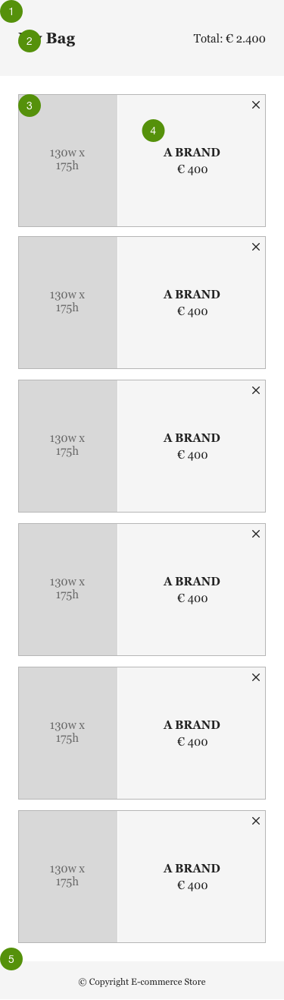
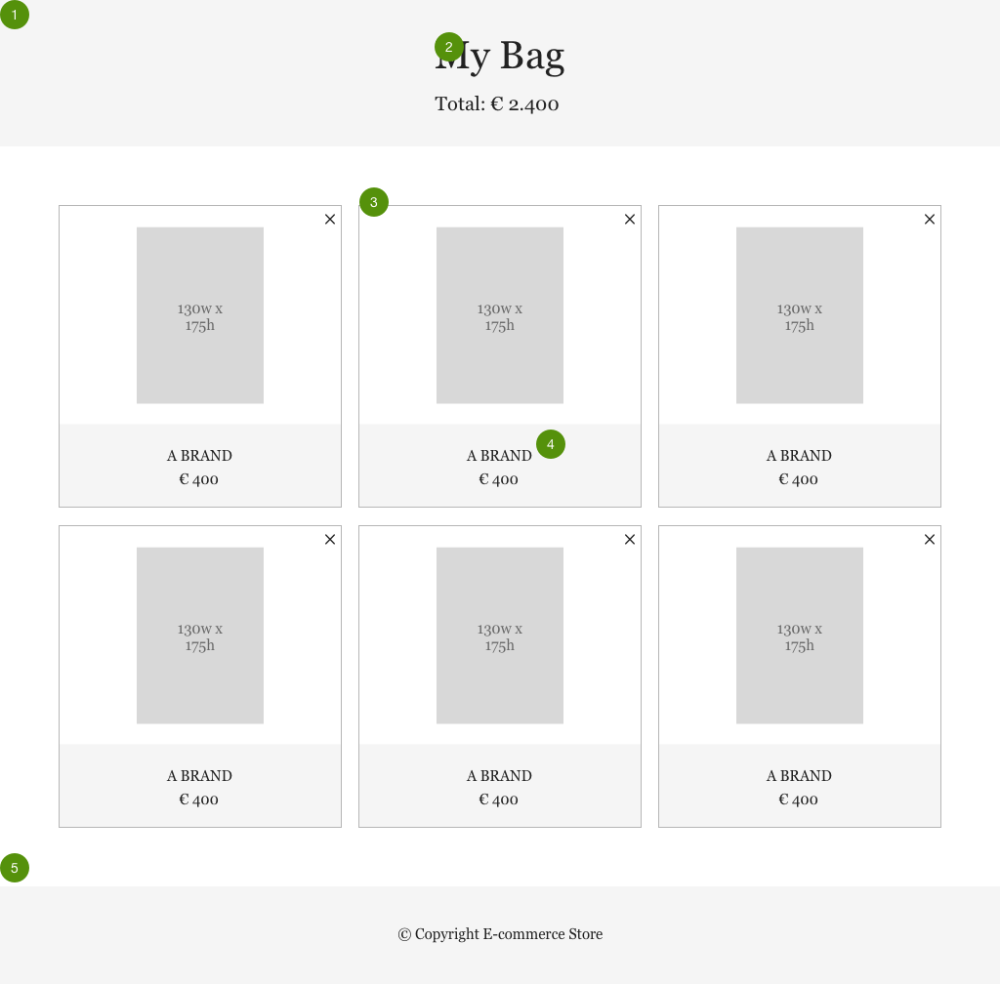

# Bag App Exercise

Imagine that you are working with your team to develop a checkout / bag application for an e-commerce platform. You decided to go for the following technology stack:

* Vanilla Javascript Components
* Webpack
* ES6 (Babel)
* SASS
* Axios
* Jest

Your colleagues already built a good part of the application which consists of a responsive **header**, **footer** and **content** areas.

They already made a mock API with a sample of user data and started to integrate it with the UI by calling the GET endpoint and listing the user's products on first load ([see instructions below](#mock-rest-api)).

In this exercise you are required to revise what's already been done so far, and complete the following missing requirements:

## Feature 1 - The Header

> As a user, I want to see a header containing the page title and the current total value of the products in my bag.
>
> ### Acceptance Criteria
>
> * The header should follow all visual requirements in the layout references.
> * Given there are N products in the system, user should see the sum of their prices in the header.

## Feature 2 - Item Removal

> As a user, I want to be able to click the X button on the product card to remove it from my list.
>
> ### Acceptance Criteria
>
> * When user clicks on the X button on the product card, the application should call the DELETE API endpoint for that item and update the **content** area and the current total on the **header** to reflect the change.

## Non-functional Requirements

1. App must run on latest versions of the following browsers: Chrome, Firefox, Edge (or Safari if you are using a Mac).

## Mobile Layout Reference



> 1. **General**
>     * Font Family: Georgia
>     * Font Color: #222
>
> 1. **Header**
>     * Background Color: #E6E6E6
>     * Size: 100px tall, full width
>     * Text is vertically center aligned inside header
>
>     * Title
>         * Font Style: 20px Bold
>         * Margin Left: 24px
>
>     * Price
>         * Font Style: 15px Regular
>         * Margin Right: 24px
>
> 1. **Card Container**
>     * Margin: 24px
>     * Grid Layout: 1 column with cards
>     * Gap Between Cards: 12px
>
> 1. **Card**
>     * Size: 175px tall
>     * Border: 1px solid #B6B6B6
>     * Image alignment: left
>     * Remove Button Alignment: top right
>     * Text (brand and price) is vertically and horizontally center aligned
>
>     * Product Information Container
>         * Background Color: #F6F6F6
>         * Brand Name Font Style: 15px bold
>         * Price Font Style: 15px regular
>         * Distance Between Brand and Price: 6px
>
> 1. **Footer**
>     * Size: 50px tall with full width
>     * Background Color: #E6E6E6
>     * Text is vertically and horizontally center aligned
>     * Font Style: 12px regular

## Desktop Layout Reference



> 1. **General**
>     * Font Family: Georgia
>     * Font Color: #222
>
> 1. **Header**
>     * Background Color: #E6E6E6
>     * Size: 150px tall, full width
>     * Text is vertically center aligned inside header
>
>     * Title
>         * Font Style: 40px Bold
>
>     * Price
>         * Font Style: 20px Regular
>         * Top distance from title: 16px
>
> 1. **Card Container**
>     * Margin: 60px
>     * Grid Layout: 3 column with cards
>     * Gap Between Cards: 18px
>
> 1. **Card**
>     * Size: 310px tall
>     * Border: 1px solid #B6B6B6
>
>     * Image Container
>         * Size: 70% tall 100% width of card
>         * Background: white
>
>     * Image
>         * Size: 130px tall, 175px wide
>         * Alignment: center (vertically and horizontally)
>
>     * Remove Button Alignment: top right
>     * Text (brand and price) is vertically and horizontally center aligned
>
>     * Product Information Container
>         * Background Color: #F6F6F6
>         * Brand Name Font Style: 15px regular
>         * Price Font Style: 15px regular
>         * Distance Between Brand and Price: 6px
>
> 1. **Footer**
>     * Size: 100px tall with full width
>     * Background Color: #E6E6E6
>     * Text is vertically and horizontally center aligned
>     * Font Style: 15px regular

## Starting the Project

1. If you don't already have it, install [node.js](https://nodejs.org)
2. Install dependencies:

```bash
$ npm install
$ npm run build
```

## Mock REST API

For this exercise we provide a simple mock API as a local node express server. To start the local server, follow the instructions bellow:

1. If you don't already have it, install [node.js](https://nodejs.org)
1. Start the server:

```bash
$ npm run server
```

By default the API will run on [http://localhost:3000](http://localhost:3000).

It will accept only two endpoints calls:

* GET /bag
* DELETE /bag/`<bag-id>`/items/`<item-id>`

You can assume `<bag-id>` to always be 'bag1'.

## Running Development Environment

Don't forget to start the mock API server, so:

```bash
$ npm run server
$ npm run dev
```

## Run Tests

```bash
$ npm test
```

## Tips

* We are expecting a simple solution to this problem. No need to over-engineer it nor introduce unnecessary complexity.
* You are allowed to refactor existing code if you feel it's necessary. Just remember to describe the reasons for it.
